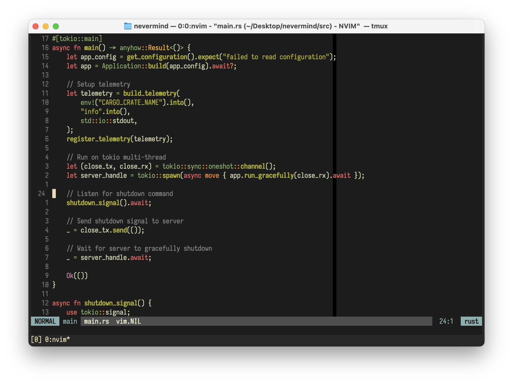

# Dotfiles
This repository contains my personal dotfiles with configuration and plugins.

Using the default Terminal app  
Font is ZedMono

## Installation

To install these dotfiles, clone the repository and move configuration into `./config`

### Dependencies 
- neovim
- tmux
- ripgrep (telescope - live_grep)
- lazygit (git client)
